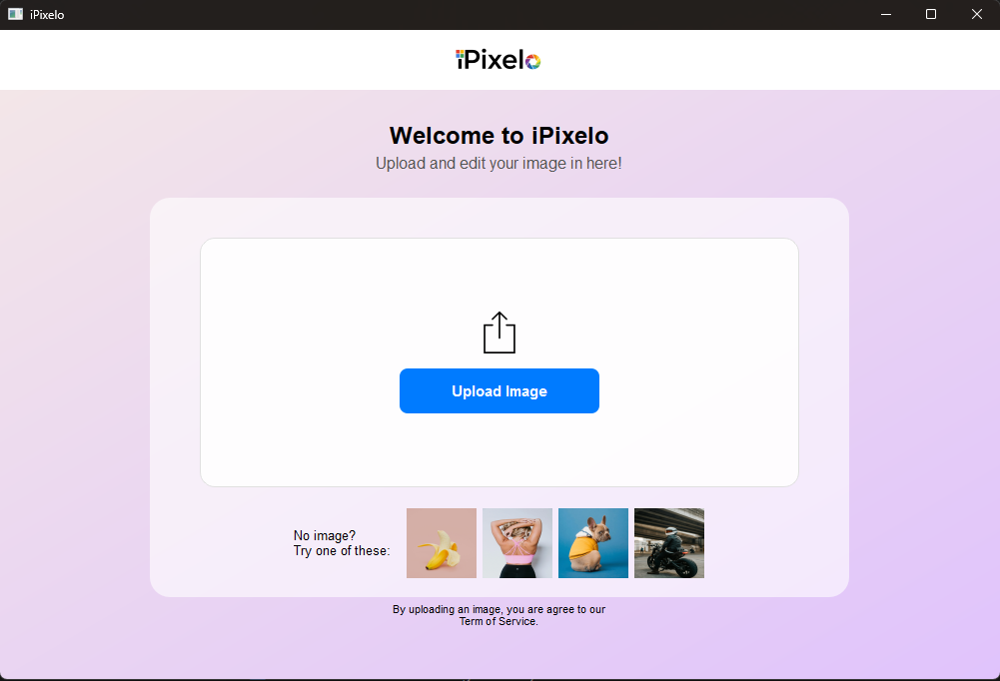
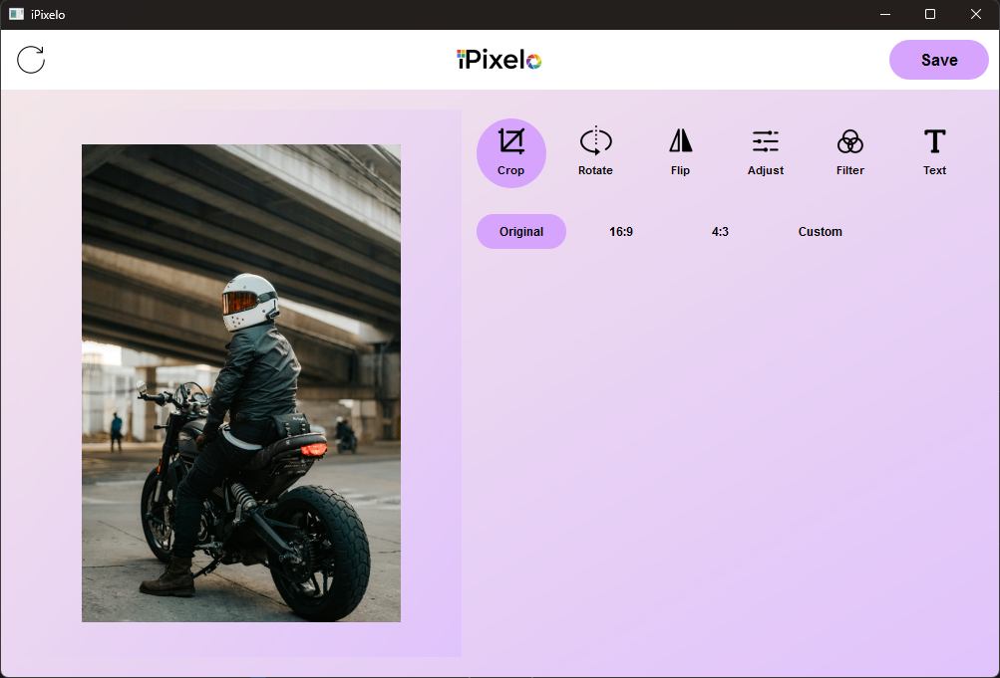

# 🎨 iPixelo

**A Mobile-Inspired Image Editing and Enhancement Application**

iPixelo is a desktop application that demonstrates the practical implementation of **image processing techniques** through an interactive graphical user interface.  
The application allows users to perform real-time image enhancement, transformations, and localized editing using computer vision algorithms.

The system integrates **OpenCV image processing capabilities with a PyQt6 GUI**, enabling users to easily manipulate images through an intuitive interface.

---

# ✨ Features

## 🖼 Image Transformations
- Crop images
- Rotate images
- Flip images horizontally and vertically

## 🎛 Image Enhancement
- Brightness adjustment
- Gaussian blur
- Noise reduction
- Image sharpening
- Saturation control

## 📍 Region of Interest (ROI) Processing
- Apply enhancements to selected regions of an image
- Allows localized image editing without affecting the entire image

## 🎨 Visual Filters
- Grayscale filter
- Bright filter
- Cool tone filter

## ✏ Text Annotation
- Insert custom text on images
- Adjustable text color and position
- Support for text rotation

## ⚡ Interactive Editing
- Real-time parameter adjustment using sliders
- Instant preview of image changes

## 🔄 Non-Destructive Editing
- Reset image to original state
- Save edited images to local storage

---

# 🛠 Technologies Used

| Category | Technology |
|--------|--------|
| Programming Language | Python |
| Image Processing | OpenCV |
| GUI Framework | PyQt6 |

---

# 🧠 Image Processing Techniques Implemented

The system demonstrates several fundamental image processing techniques including:

- Image filtering
- Pixel intensity manipulation
- Geometric transformations
- Region-based image processing
- Color space manipulation

These techniques form the foundation of many **computer vision and multimedia processing applications**.

---

# 🎯 Project Objective

The goal of iPixelo is to demonstrate how **computer vision algorithms can be integrated with GUI applications** to create an interactive image editing tool.

The project highlights the practical application of image processing concepts such as filtering, transformations, and visual enhancements.

---

# 📈 Learning Outcomes

Through the development of iPixelo, the project demonstrates:

- Implementation of **OpenCV image processing algorithms**
- Integration of **computer vision with GUI development**
- Real-time image manipulation techniques
- Interactive user interface design using **PyQt6**

---

# 📄 License

This project was developed for **academic purposes at Universiti Teknologi Malaysia (UTM)**.

# 🖥 System Preview

